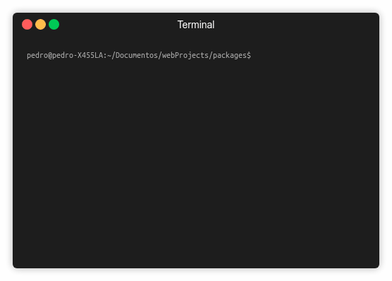

# create-react-app-full

An custom CLI for React app based on Facebook's create-react-app

## Prerequisites

You need node, npm and Facebook's create-react-app CLI installed.
You can verify those as follow:

If there's something missing, checkout the official sites of:
* [create-react-app](https://github.com/facebook/create-react-app)
* [NodeJs and NPM](https://nodejs.org/en/)

## Installing

You can install create-react-app-full easily as follow

## Usage

## Build With

* [ShellJs](https://github.com/shelljs/shelljs) - for shell commands
* [ColorsJs](https://github.com/marak/colors.js/) - for coloring the terminal

## Authors

* **[Pedro Gómez](https://github.com/petrlr14)**

## License

This project is licensed under the MIT License - see the [LICENSE.md](LICENSE.md) file for details