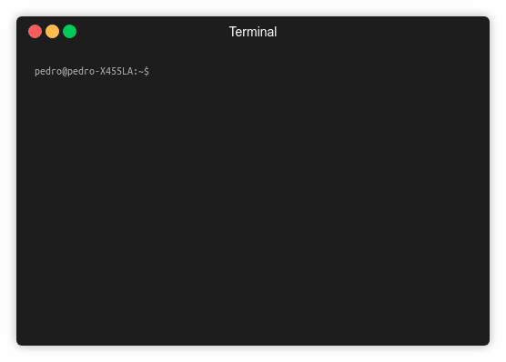

# create-react-app-full

An custom CLI for React app based on Facebook's create-react-app

### Prerequisites

You need node, npm and Facebook's create-react-app CLI installed.
You can verify those as follow:

### Installing

You can install create-react-app-full easily as follow

* [Dropwizard](http://www.dropwizard.io/1.0.2/docs/) - The web framework used
* [Maven](https://maven.apache.org/) - Dependency Management
* [ROME](https://rometools.github.io/rome/) - Used to generate RSS Feeds

## Authors

* **[Pedro Gómez](https://github.com/PurpleBooth)**

## License

This project is licensed under the MIT License - see the [LICENSE.md](LICENSE.md) file for details